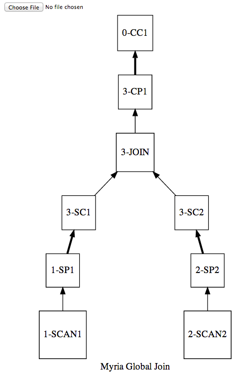

Visualize a Myria query plan (JSON)
===================================

1. Run `convert_json_to_gv.py` and save the output in a `.gv` file.

   for new queries (which contain "fragments")
       ./convert_json_to_gv.py ../../jsonQueries/sample_queries/single_join.json \
           > single_join.gv

   for old queries (which contain "query_plan")
       ./convert_v1_json_to_gv.py ../../jsonQueries/globalJoin_jwang/global_join.json \
           > global_join.gv
           
2. Open `vizplan.html` in an HTML5-compliant web browser. (I've only tested in Chrome.)

   **On Mac:** `open vizplan.html`

3. Open the `.gv` file in the file input box, and the plan will appear!

   Thin lines are local, thick lines are distributed. Operators with the same number in front are from the same plan fragment. Identical plan fragments that run on different workers are combined together.

   
